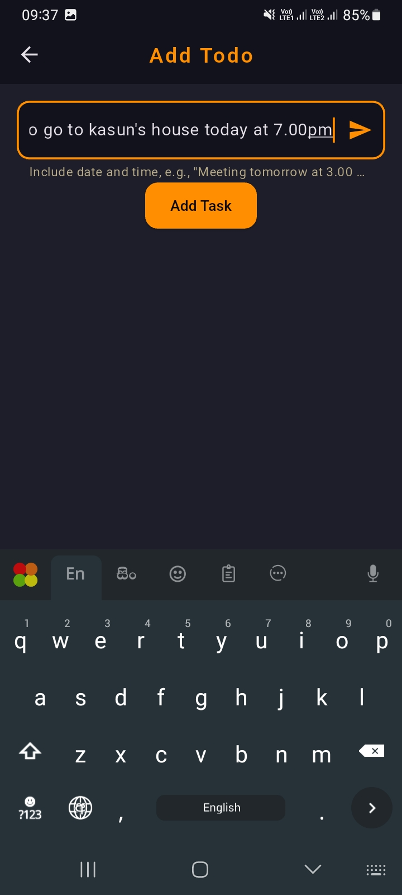

# 📝 Smart Task Management

  

  
  

## 🌟 Features

### 🤖 Natural Language Processing
- Create tasks using natural language
- Automatically extracts dates and times
- Understands recurring patterns
- Smart title generation

### ⏰ Advanced Task Management
- Daily, weekly, monthly, and yearly recurring tasks
- Due date and time tracking
- Task completion status
- Overdue task highlighting
- Task categorization

### 🗑️ Intelligent Cleanup
- 30-day recycle bin
- Automatic cleanup of expired tasks
- Restore deleted tasks
- Smart task archiving

### 📱 User Experience
- Clean, modern dark theme UI
- Intuitive swipe actions
- Quick task editing
- Task filtering options
- Responsive design

## 📱 Screenshots

  
  
  
  
  
  
  
  
  
  

## ⚡ Quick Start

### Download
Get the latest version of LionAI Todo:

### Requirements
- Android 5.0 (API level 21) or higher
- 50 MB of free storage

### Installation
1. Download the APK file
2. Enable "Install from Unknown Sources" in your device settings
3. Open the APK file to install
4. Start managing your tasks smarter!

## 🎯 How It Works

### Natural Language Input
Simply type your task as you would say it:
- "Meeting with John next Monday at 2.00pm"
- "I have to study for exam on next Saturday at 4:00pm"
- "Pay rent on 2025/02/25 every month at 10.00am"

### Smart Features
- **Automatic Date Recognition**: Understands relative dates like "tomorrow," "next week"
- **Time Parsing**: Flexible time input (2.00pm, 14:00, etc.)
- **Recurring Pattern Detection**: Automatically identifies repetitive tasks
- **Context-Aware Suggestions**: Provides relevant examples based on task type

## 🛠️ Technical Details

Built with:
- Flutter for cross-platform development
- Hive for local data persistence
- Custom natural language processing engine
- Google Mobile Ads integration

## 🔒 Privacy

 Smart Task Management Todo:
- Works completely offline
- No data collection
- No internet permission required
- No personal information needed

## 📫 Support & Feedback

For support, feature requests, or bug reports:
- Create an issue on GitHub
- Email: <a href="mailto:kalharawimukthi0617@gmail.com">kalharawimukthi0617@gmail.com</a>

---

  Made with ❤️ by Kalhara Wimukthi

